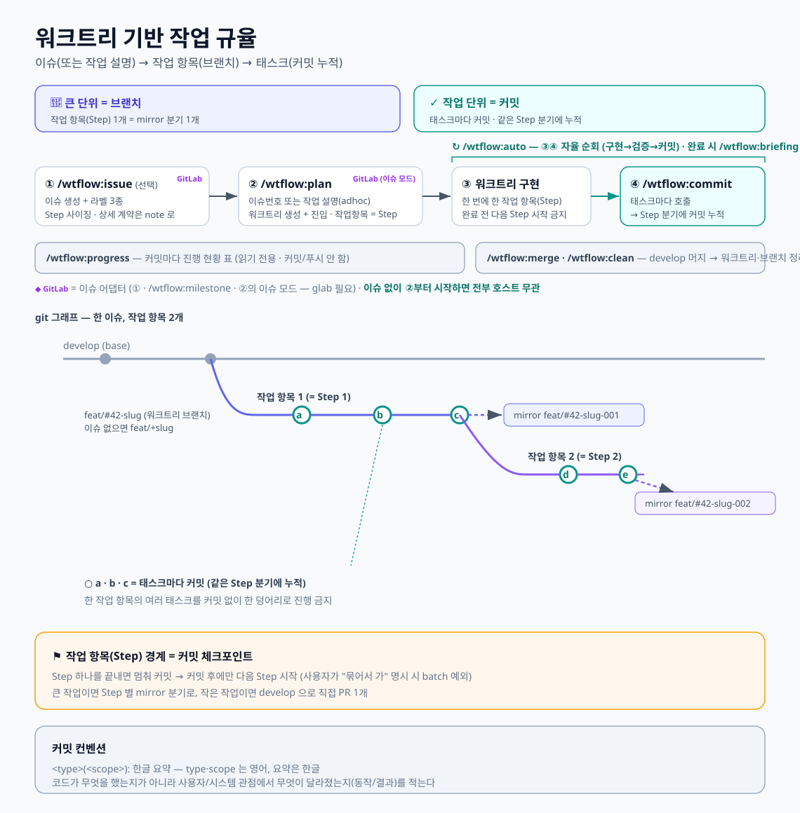

# claude-wtflow

git worktree 위에서 한 작업을 **작업 항목(K) 단위로 분기**하고 **태스크마다 커밋으로 누적**하는 작업 규율 [Claude Code](https://claude.com/claude-code) 스킬셋.
코어는 호스트 무관, 이슈 연동은 옵션 어댑터(현재 GitLab).



## 스킬

```
코어 — 호스트 무관 (GitHub·GitLab·이슈 없어도 동작)
  /wtflow-commit     태스크 단위 커밋 + mirror 분기(…-00N) 누적
  /wtflow-auto       plan 의 K 자율 순회 (구현 → 검증 → /wtflow-commit → 완료 시 /wtflow-briefing)
  /wtflow-progress   K 진행 현황 표 + 이슈↔note drift 보고 (읽기 전용)
  /wtflow-briefing   작업 전체를 설계문서형 브리핑으로 정리 (git·대화 근거, 읽기 전용)
  /wtflow-merge      안 머지된 작업 브랜치를 develop 으로 (충돌 해소 + 빌드 검증)
  wtflow-clean       워크트리·이슈 브랜치 정리 (마커 보존, -a 로 마커까지)

이슈 어댑터 — 옵션 · GitLab (glab 필요)
  /wtflow-issue      이슈 생성 + 이슈 note 작성
  /wtflow-plan       이슈 → 워크트리·브랜치 + note 로드 + plan(작업 항목 = K) 매핑
  /wtflow-milestone  여러 이슈에 걸친 공통 계약 note + 이슈 분할 생성
```

개념(2층 모델 · 작업 항목↔`-00N` 분기 · 커밋 규율)은 위 다이어그램에 다 있음. 행동 정책·브랜치 이름 규칙·커밋 컨벤션은 [`CLAUDE.md`](./CLAUDE.md).

## 브랜치와 note

```
<prefix>/#<N>-<slug>          워크트리 브랜치 = accumulator = 이슈 마커  (plan 이 생성)
<prefix>/#<N>-<slug>-<KKK>    작업 항목 K 의 mirror 분기               (commit 이 생성)

~/.claude/notes/<group>/
  _milestone/<iid>-<slug>.md  여러 이슈·레포가 공유하는 계약
  <repo>/issue-<N>.md         이슈 하나의 계획 (K별 계약·파일 위치)
```

이슈 본문은 "무엇/왜"만 두고 페이로드·타입·에러코드 같은 상세는 note 로 뺀다. note 는 git 밖(홈)에 단일 실체로 두고 워크트리엔 심링크로 꽂히므로, 진행 중 고친 계약이 다른 브랜치·세션에서도 즉시 읽힌다 — 그 심링크를 거는 게 `hooks/link-worktree-local.sh` 다.

## 설치

```
git clone https://github.com/JunseokAhn/claude-wtflow.git
cd claude-wtflow
./install.sh
```

`skills/*` → `~/.claude/skills/`, `wtflow-clean` → `~/.local/bin/`, `hooks/*` → `~/.claude/hooks/` 심링크 (`CLAUDE_HOME`·`BIN_DIR` 로 변경, 기존 실파일은 안 덮음).

훅은 심링크만으로는 안 돌고 `~/.claude/settings.json` 에 등록해야 한다 (설치 스크립트가 붙여넣을 JSON 을 출력한다):

```json
"SessionStart": [{ "matcher": "*", "hooks": [
  { "type": "command", "command": "$HOME/.claude/hooks/link-worktree-local.sh" } ]}],
"CwdChanged":   [{ "matcher": "*", "hooks": [
  { "type": "command", "command": "$HOME/.claude/hooks/link-worktree-local.sh" } ]}]
```

## 비고

- 이슈 어댑터(`wtflow-issue`·`wtflow-plan`·`wtflow-milestone`)는 `glab` CLI 필요. 코어는 의존성 없음.
- `wtflow-clean`·`wtflow-merge` 는 origin 을 건드리지 않음 (로컬 분기·워크트리만, push 는 사용자 몫).
- `link-worktree-local.sh` 는 워크트리에 `CLAUDE.md`·`.claude/*`·`.env*` 처럼 gitignore 돼 따라오지 않는 로컬 파일도 함께 걸어준다. 언어·프레임워크 무관, 원본에 없으면 건너뛰고 어떤 경우에도 세션을 막지 않는다.
